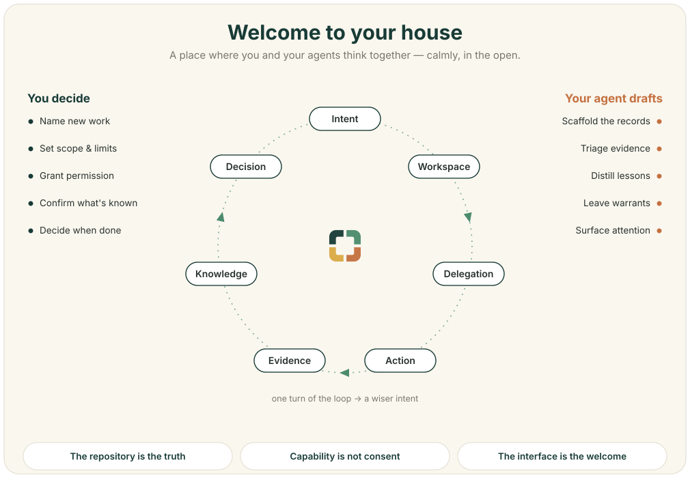

# ZenOS RC0 — Start a House for Human–AI Work

ZenOS is a repository-based environment where people and intelligent
participants pursue real work through explicit intent, bounded delegation,
observable evidence, and steward judgment.



This repository is a **private release candidate for testing and review**. It
is not yet a public release, client instance, or claim of production fitness.

## Begin here

If you are the human steward:

1. Read [WELCOME.md](WELCOME.md) for the idea in plain language.
2. Keep [prompt-flow.md](prompt-flow.md) nearby for useful ways to begin and
   steer a session with an agent.
3. Follow [ONBOARDING.md](ONBOARDING.md) when you are ready to create the first
   real institutional records.

If you are an AI participant, begin with [AGENTS.md](AGENTS.md). It defines the
house rules, read order, and authority boundary.

## The operating loop

```text
Intent → Workspace → Delegation → Action → Evidence → Knowledge → Decision
   ↑                                                                    |
   └──────────────────────────── a wiser intent ────────────────────────┘
```

The steward supplies purpose, limits, permission, and final judgment.
Participants propose and execute within those bounds. Plain files preserve why
the work belongs, what changed, and how later participants can understand it.

## What travels in RC0

- RFC-0000 through RFC-0007, preserved exactly from the frozen source;
- a dependency-closed but uninstantiated house layout;
- templates for the first intent, workspace, delegation, evidence, knowledge,
  decision, participant, and warrant loop;
- progressive human and agent arrival guidance;
- six host-neutral constitutional checks and a fail-closed runner;
- a read-only, fork-safe hosted CI adapter; and
- deterministic provenance and an explicit file allowlist.

## What does not travel

No living-house history, participant roster, evidence, warrant trail, client
data, credentials, runtime configuration, generated status, or application
fixture is present. A receiving steward creates the first real relationships
locally.

## Where authority lives

The repository is the source of truth. Guides and interfaces help people see
the house; prompts help them speak to it. None of them grants authority.
Significant work still requires a traceable intent and bounded delegation, and
the steward retains the judgments reserved by the Constitution.

## Candidate licences

The included `LICENSE`, `LICENSE-docs`, and `NOTICE` are candidate instruments
under review. They do not authorize public release until the steward completes
the independent rights, disclosure, and counsel gates recorded in
[RIGHTS-STATUS.md](RIGHTS-STATUS.md).
